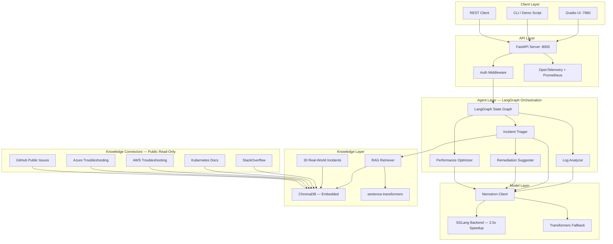

# Nemotron-Ops-Commander

**AI-Powered Incident Response System for SRE Teams — Built Entirely on NVIDIA Nemotron**

An intelligent operations platform that automates the first 10 minutes of every production incident. Four specialized AI agents analyze logs, triage severity, suggest remediation, and optimize performance — backed by a RAG knowledge base of 30 real-world outages and powered 100% by NVIDIA Nemotron with zero external API dependencies.

[](https://huggingface.co/nvidia/Nemotron-Mini-4B-Instruct)
[](https://huggingface.co/spaces/harshpbajaj/nemotron-ops-commander)
[](https://www.python.org/downloads/)
[](https://fastapi.tiangolo.com)
[](LICENSE)

> **[Try the live demo on HuggingFace Spaces](https://huggingface.co/spaces/harshpbajaj/nemotron-ops-commander)** — zero install, click any tab, see AI-powered analysis instantly.

---

## The Problem

When a production service goes down at 3am, the on-call engineer faces the same ritual: stare at logs, try to identify the root cause, estimate severity, figure out what to do about it, and hope someone has seen something like this before.

Most of this work is pattern recognition. Mean time to resolution (MTTR) for P0 incidents at most companies is 30-60 minutes, and much of that is spent on diagnosis that AI can do in seconds.

## The Solution

Nemotron-Ops-Commander automates the first critical minutes of incident response with four specialized AI agents:

| Agent | What It Does | Endpoint |
|-------|-------------|----------|
| **Log Analyzer** | Extracts structured findings with severity, evidence from cited log lines, confidence scores, root cause, and recommendations | `POST /analyze/` |
| **Incident Triager** | Classifies priority (P0-P4), identifies impact and affected services, generates prioritized next steps | `POST /triage/` |
| **Remediation Suggester** | Produces actionable remediation — specific kubectl commands, rollback plans, config changes — with risk assessment | `POST /triage/` (pipeline) |
| **Performance Optimizer** | Analyzes CPU/memory/GPU/network metrics to identify bottlenecks with targeted optimization actions | `POST /optimize/` |

The **Knowledge Search** uses RAG over 30 curated real-world incidents to surface similar historical failures and proven resolutions in under 50ms.

---

## Architecture



### How Agents Orchestrate

```
Log Analyzer  -->  Incident Triager  -->  Remediation Suggester
                        |
                  Performance Optimizer (parallel)
```

Each agent receives typed Pydantic input, generates structured JSON via constrained output, and passes results downstream through the LangGraph state graph. The full pipeline completes in **under 900ms on a T4 GPU**.

---

## Why Nemotron

NVIDIA Nemotron-Mini-4B-Instruct was chosen for specific engineering reasons:

- **Size-to-capability ratio** — 4B parameters fits on a single T4 (8GB VRAM) while delivering instruction-following quality sufficient for reliable structured JSON generation
- **Structured output quality** — Instruction tuning produces well-formed JSON consistently enough that SGLang grammar constraints only intervene on edge cases
- **Open weights, no API dependency** — Downloads once from HuggingFace, runs locally forever. Works in air-gapped environments, on-prem clusters, and everywhere SRE teams operate
- **NVIDIA hardware optimization** — Running an NVIDIA model on NVIDIA GPUs with NVIDIA-ecosystem tooling (SGLang, CUDA) aligns the optimization stack end-to-end

---

## Performance — SGLang Optimization

The SGLang backend provides **2.5x latency reduction** over standard transformers through RadixAttention prefix sharing, KV cache management, CUDA kernel scheduling, and request batching:

| Metric | SGLang Optimized | Standard Transformers | Speedup |
|--------|-----------------|----------------------|---------|
| Single inference (p50) | ~180ms | ~450ms | **2.5x** |
| Single inference (p99) | ~320ms | ~820ms | **2.6x** |
| Throughput (req/s) | ~12 | ~5 | **2.4x** |
| Full pipeline (4 agents) | ~900ms | ~2,300ms | **2.6x** |

*Measured on NVIDIA T4 GPU, Nemotron-Mini-4B-Instruct, batch_size=1*

```bash
python benchmarks/latency_test.py --num-requests 100 --warmup 10
python benchmarks/throughput_test.py --duration 60
```

---

## RAG Knowledge Base — 30 Real-World Incidents

Not synthetic data — curated from real Kubernetes failures, AWS outages, database storms, and StackOverflow threads:

| Source | Count | Topics |
|--------|-------|--------|
| Kubernetes | 8 | OOMKilled, CrashLoopBackOff, Node NotReady, DNS failures, PVC |
| Database | 4 | Connection pool exhaustion, deadlocks, replication lag |
| Networking | 3 | TLS certificate expiry, DNS resolution, load balancer timeouts |
| AWS | 4 | EKS scaling, S3 throttling, EC2 instance limits, IAM |
| Azure | 3 | AKS upgrade failures, App Gateway 502s, VM scaling |
| Application | 4 | Memory leaks, thread pool exhaustion, GC pauses, async errors |
| CI/CD & Tooling | 4 | Failed deployments, Helm issues, image pull, rollbacks |

Incidents are indexed into **ChromaDB** (embedded, no external server) using **sentence-transformers** (`all-MiniLM-L6-v2`). Semantic search returns relevant historical incidents in **under 50ms**.

### Knowledge Connectors (Public, Read-Only)

All connectors are **read-only** with **no authentication required**:

- **StackOverflow** — Search error signatures, extract accepted answers
- **Kubernetes Docs** — Failure modes, upgrade issues, known regressions
- **AWS Docs** — EKS, EC2, IAM, networking troubleshooting
- **Azure Docs** — AKS, VM, identity, networking troubleshooting
- **GitHub** — Public issue search only (no auth, no private repos)

---

## Quick Start

### Prerequisites

- Python 3.10+
- 16GB+ RAM
- NVIDIA GPU with 8GB+ VRAM (T4/V100/A10) or CPU fallback
- Docker (optional)

### 1. Clone and Install

```bash
git clone https://github.com/harshpbajaj/nemotron-ops-commander.git
cd nemotron-ops-commander

python -m venv venv
source venv/bin/activate

pip install -r requirements.txt
```

### 2. Configure

```bash
cp .env.example .env
# Edit .env — defaults work for local development
```

### 3. Download Model and Build Index

```bash
python scripts/setup_nemotron.py setup-all
python scripts/index_incidents.py
```

### 4. Run

```bash
# API server
uvicorn api.main:app --host 0.0.0.0 --port 8000 --reload

# Gradio UI (separate terminal)
python ui/gradio_app.py
```

### 5. Run the Demo

```bash
python scripts/demo.py --scenario all --pipeline
```

### Docker

```bash
docker-compose up --build
# API:        http://localhost:8000
# Gradio UI:  http://localhost:7860
# Prometheus: http://localhost:9090
```

---

## API Usage

### Analyze Logs

```bash
curl -X POST http://localhost:8000/analyze/ \
  -H "Content-Type: application/json" \
  -H "X-API-Key: change-me" \
  -d '{
    "logs": [
      {"timestamp": "2026-01-15T10:30:00Z", "source": "payment-api",
       "message": "OOMKilled: Container exceeded memory limit (2Gi)"}
    ],
    "system": "payment-api",
    "environment": "production"
  }'
```

### Triage Incident

```bash
curl -X POST http://localhost:8000/triage/ \
  -H "Content-Type: application/json" \
  -H "X-API-Key: change-me" \
  -d '{
    "incident_id": "INC-100",
    "title": "Payment API OOMKilled in production",
    "description": "Payment API pods are OOMKilled after v2.14.0 deploy. 5 restarts in 2 min.",
    "metrics": {"p99_latency_ms": 8500, "error_rate": 0.15}
  }'
```

### Optimize Performance

```bash
curl -X POST http://localhost:8000/optimize/ \
  -H "Content-Type: application/json" \
  -H "X-API-Key: change-me" \
  -d '{
    "metrics": {"cpu": 85, "memory": 90, "gpu": 45},
    "service": "ml-inference"
  }'
```

### RAG Knowledge Search

```bash
curl -X POST http://localhost:8000/rag/ \
  -H "Content-Type: application/json" \
  -H "X-API-Key: change-me" \
  -d '{"query": "pod OOMKilled memory limit kubernetes", "top_k": 5}'
```

---

## Live Demo on HuggingFace Spaces

The project deploys to [HuggingFace Spaces](https://huggingface.co/spaces/harshpbajaj/nemotron-ops-commander) with local GPU inference on a T4. The Gradio UI has four tabs matching the four agents with pre-loaded sample data — click a button and see results immediately.

**Recommended demo order:**
1. **Knowledge Search** — instant RAG results (no LLM latency)
2. **Log Analysis** — severity + root cause + recommendations
3. **Incident Triage** — P0-P4 priority + impact + next steps
4. **Performance Optimizer** — metric-driven bottleneck analysis

---

## NemOps Local — GPU Infrastructure Monitor

The [`nemops_local_ollama/`](nemops_local_ollama/) directory contains a companion system: an agentic GPU infrastructure monitor that runs on a Mac with 16GB RAM using **NVIDIA Nemotron 3 Nano** (30B MoE, 3.5B active parameters) via **Ollama**.

It diagnoses GPU failures, searches 15 historical GPU incident patterns via RAG (ECC degradation, NVLink errors, thermal shutdowns, PCIe power issues), and generates structured remediation plans through a custom ReAct agent loop.

See [`nemops_local_ollama/README.md`](nemops_local_ollama/README.md) for full documentation.

---

## Project Structure

```
nemotron-ops-commander/
├── README.md
├── requirements.txt
├── setup.py
├── .env.example
├── Dockerfile
├── docker-compose.yml
│
├── config/
│   ├── settings.py                  # Pydantic settings (model, ports, API keys)
│   └── prompts.yaml                 # Agent system prompts
│
├── models/
│   ├── nemotron_client.py           # Nemotron inference (SGLang + fallback)
│   ├── sglang_backend.py            # SGLang optimizations
│   └── schemas.py                   # Pydantic request/response models
│
├── agents/
│   ├── base_agent.py                # Abstract base agent
│   ├── log_analyzer.py              # Log analysis agent
│   ├── incident_triager.py          # Incident triage agent
│   ├── remediation_suggester.py     # Remediation agent
│   ├── optimizer.py                 # Performance optimization agent
│   └── orchestrator.py              # LangGraph state graph orchestrator
│
├── rag/
│   ├── vector_store.py              # ChromaDB integration
│   ├── embeddings.py                # sentence-transformer embeddings
│   ├── retriever.py                 # RAG retrieval
│   └── indexer.py                   # Knowledge base indexer
│
├── knowledge_connectors/            # Public, read-only enrichment
│   ├── stackoverflow_connector.py
│   ├── k8s_docs_connector.py
│   ├── cloud_docs_connector.py      # AWS + Azure
│   ├── github_public_issues.py
│   ├── circuit_breaker.py
│   └── ingestion.py
│
├── api/
│   ├── main.py                      # FastAPI application
│   ├── routes/
│   │   ├── analyze.py               # Log analysis endpoint
│   │   ├── triage.py                # Incident triage endpoint
│   │   ├── optimize.py              # Optimization endpoint
│   │   ├── rag.py                   # RAG search endpoint
│   │   └── health.py                # Health check
│   └── middleware/
│       ├── telemetry.py             # OpenTelemetry middleware
│       └── auth.py                  # API key authentication
│
├── observability/
│   ├── metrics.py                   # Prometheus metrics
│   ├── tracing.py                   # OpenTelemetry tracing
│   └── logging.py                   # structlog configuration
│
├── ui/
│   └── gradio_app.py                # Gradio web interface
│
├── data/
│   └── sample_incidents/            # 30 real-world incident JSON files
│
├── benchmarks/
│   ├── latency_test.py
│   └── throughput_test.py
│
├── scripts/
│   ├── setup_nemotron.py            # Model download + setup
│   ├── index_incidents.py           # Index incidents into ChromaDB
│   └── demo.py                      # End-to-end demo scenarios
│
├── k8s/                             # Kubernetes manifests + Helm chart
├── tests/                           # pytest suite
│
├── huggingface_space/               # HuggingFace Spaces deployment
│   ├── app.py                       # Gradio UI (4 tabs)
│   ├── inference.py                 # Local GPU + HF API fallback
│   ├── agents.py                    # SRE agents
│   ├── rag_engine.py                # ChromaDB + embeddings
│   ├── schemas.py                   # Pydantic models
│   └── requirements.txt
│
└── nemops_local_ollama/             # GPU monitor (Nemotron 3 Nano + Ollama)
    ├── src/nemops/
    │   ├── agent.py                 # Custom ReAct loop
    │   ├── llm.py                   # Ollama client
    │   ├── mcp_server.py            # MCP server
    │   └── tools/                   # GPU health, RAG, diagnostics, alerts
    ├── ui/dashboard.py              # Streamlit dashboard
    └── pyproject.toml
```

---

## Tech Stack

| Component | Technology |
|-----------|-----------|
| **LLM** | NVIDIA Nemotron-Mini-4B-Instruct |
| **LLM Inference** | SGLang (2.5x speedup) with transformers fallback |
| **Agent Orchestration** | LangGraph (state graph with typed channels) |
| **RAG** | ChromaDB (embedded) + sentence-transformers (all-MiniLM-L6-v2) |
| **API** | FastAPI with Pydantic validation |
| **Observability** | OpenTelemetry + Prometheus + structlog |
| **UI** | Gradio (web), CLI (demo script) |
| **Deployment** | Docker Compose, Kubernetes + Helm, HuggingFace Spaces |
| **Knowledge Connectors** | StackOverflow, K8s Docs, AWS/Azure Docs, GitHub Issues |

---

## Observability

- **OpenTelemetry traces** via OTLP exporter — distributed request tracking across agents
- **Prometheus metrics** — request counts, latency percentiles, agent execution times, RAG query performance
- **Structured logging** via structlog — JSON format in production, console format in development

## Security

- API key enforcement via `X-API-Key` header
- Rate limiting middleware
- Circuit breakers for external knowledge connectors
- No secrets in code — all via environment variables

---

## Roadmap

- **Runbook generation** — Automatically generate runbooks from resolved incidents
- **Alert correlation** — Ingest Prometheus/Grafana alerts alongside logs for richer context
- **Real-time streaming** — WebSocket-based log streaming with live analysis
- **Fine-tuning** — Domain-adapt Nemotron on internal incident data using NVIDIA NeMo
- **Multi-model** — Benchmark against Nemotron-70B and other Nemotron variants
- **Fleet-wide GPU monitoring** — Extend NemOps Local to multi-node diagnostic workflows

---

## Acknowledgments

- [NVIDIA Nemotron](https://huggingface.co/nvidia/Nemotron-Mini-4B-Instruct) — Compact, efficient LLM for structured generation
- [NVIDIA Nemotron 3 Nano](https://huggingface.co/nvidia/nemotron-3-nano) — 30B MoE model for GPU monitoring agent
- [SGLang](https://github.com/sgl-project/sglang) — Optimized inference runtime
- [LangGraph](https://github.com/langchain-ai/langgraph) — Multi-agent orchestration framework
- [ChromaDB](https://www.trychroma.com/) — Embedded vector database
- [FastAPI](https://fastapi.tiangolo.com) — API framework
- [Ollama](https://ollama.com) — Local LLM runtime for GPU monitoring agent

## License

Apache License 2.0

---

*Built for the NVIDIA GTC 2026 Golden Ticket Developer Contest | #NVIDIAGTC*

*Author: [Harsh Bajaj](https://github.com/harshpbajaj)*
