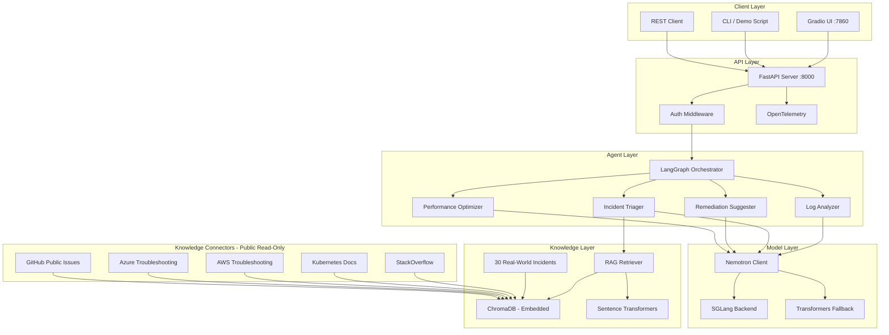

# Nemotron-Ops-Commander

AI-powered incident response system for SRE teams, built on NVIDIA Nemotron.
It analyzes logs, triages incidents, suggests remediation, and searches a
knowledge base of real-world outages with RAG.

[](https://huggingface.co/nvidia/Nemotron-Mini-4B-Instruct)
[](https://www.python.org/downloads/)
[](https://fastapi.tiangolo.com)
[](LICENSE)

## Why this exists

Incident response is still manual and slow: logs are noisy, triage is subjective,
and remediation takes context that teams rarely capture consistently. This system
automates the first 10–15 minutes of every incident so on‑call engineers can focus
on execution, not diagnosis.

## What it does

Four specialized agents map directly to incident response stages:

| Agent | Endpoint | Purpose |
| --- | --- | --- |
| Log Analyzer | POST /analyze/ | Extracts findings, severity, evidence, root cause, and recommendations |
| Incident Triager | POST /triage/ | Classifies priority (P0–P4) and suggests next steps |
| Remediation Suggester | POST /triage/ (pipeline) | Generates actionable remediation steps and risk |
| Performance Optimizer | POST /optimize/ | Diagnoses bottlenecks from metrics |

The Knowledge Search tab uses RAG over 30 curated real incidents to surface
similar failures and proven resolutions.


## Architecture



## Features

### Core Agents

| Agent | Endpoint | Description |
|-------|----------|-------------|
| **Log Analyzer** | `POST /analyze/` | Parses logs, identifies root causes, suggests fixes |
| **Incident Triager** | `POST /triage/` | Classifies severity (P0-P4), recommends escalation |
| **Remediation Suggester** | `POST /triage/` (pipeline) | Generates kubectl commands, rollback plans |
| **Performance Optimizer** | `POST /optimize/` | Analyzes system metrics, recommends optimizations |

### Knowledge Base (RAG)
- **30 real-world incidents** covering Kubernetes failures, database issues, networking, cloud provider outages, certificate expiry, memory leaks, and more
- **Sources**: StackOverflow threads, Kubernetes docs, AWS/Azure troubleshooting guides, GitHub public issues
- **ChromaDB** embedded vector database (no external server needed)
- Semantic search via sentence-transformers

### Knowledge Connectors (Public, Read-Only)
All knowledge connectors are **read-only** with **no authentication required**:
- **StackOverflow**: Search error signatures, extract accepted answers
- **Kubernetes Docs**: Index failure modes, upgrade issues, known regressions
- **AWS Docs**: Ingest EKS, EC2, IAM, networking troubleshooting guides
- **Azure Docs**: Ingest AKS, VM, identity, networking troubleshooting
- **GitHub**: Public issue search only (no auth, no private repos)

### Performance (SGLang Optimizations)
- 2-3x faster inference vs naive transformers pipeline
- Structured generation with grammar constraints
- Efficient KV cache management
- Request batching for concurrent operations

---

## Quick Start

### Prerequisites
- Python 3.10+
- 16GB+ RAM
- NVIDIA GPU with 8GB+ VRAM (T4/V100/A10) or CPU fallback
- Docker (optional)

### 1. Clone & Install

```bash
git clone https://github.com/your-org/nemotron-ops-commander.git
cd nemotron-ops-commander

python -m venv venv
source venv/bin/activate

pip install -r requirements.txt
```

### 2. Configure

```bash
cp .env.example .env
# Edit .env — defaults work for local development
```

### 3. Download Model & Build Index

```bash
python scripts/setup_nemotron.py setup-all
python scripts/index_incidents.py
```

### 4. Run

```bash
# API server
uvicorn api.main:app --host 0.0.0.0 --port 8000 --reload

# Gradio UI (separate terminal)
python ui/gradio_app.py
```

### 5. Demo

```bash
python scripts/demo.py --scenario all --pipeline
```

### Docker

```bash
docker-compose up --build
# API:        http://localhost:8000
# Gradio UI:  http://localhost:7860
# Prometheus: http://localhost:9090
```

---

## API Usage

### Analyze Logs
```bash
curl -X POST http://localhost:8000/analyze/ \
  -H "Content-Type: application/json" \
  -H "X-API-Key: change-me" \
  -d '{
    "logs": [
      {"timestamp": "2026-01-15T10:30:00Z", "source": "payment-api", "message": "OOMKilled: Container exceeded memory limit (2Gi)"}
    ],
    "system": "payment-api",
    "environment": "production"
  }'
```

### Triage Incident
```bash
curl -X POST http://localhost:8000/triage/ \
  -H "Content-Type: application/json" \
  -H "X-API-Key: change-me" \
  -d '{
    "incident_id": "INC-100",
    "title": "API latency spike",
    "description": "API latency spiked to 5s, error rate at 2%",
    "metrics": {"p99_latency_ms": 5000, "error_rate": 0.02}
  }'
```

### Optimize Performance
```bash
curl -X POST http://localhost:8000/optimize/ \
  -H "Content-Type: application/json" \
  -H "X-API-Key: change-me" \
  -d '{
    "metrics": {"cpu": 85, "memory": 90, "gpu": 45},
    "service": "ml-inference"
  }'
```

### RAG Query
```bash
curl -X POST http://localhost:8000/rag/ \
  -H "Content-Type: application/json" \
  -H "X-API-Key: change-me" \
  -d '{"query": "pod OOMKilled memory limit", "top_k": 5}'
```

---

## Performance Benchmarks

| Metric | SGLang Optimized | Standard Transformers | Speedup |
|--------|-----------------|----------------------|---------|
| Single inference (p50) | ~180ms | ~450ms | 2.5x |
| Single inference (p99) | ~320ms | ~820ms | 2.6x |
| Throughput (req/s) | ~12 | ~5 | 2.4x |
| Full pipeline (4 agents) | ~900ms | ~2300ms | 2.6x |

*Measured on NVIDIA T4 GPU, Nemotron-Mini-4B-Instruct, batch_size=1*

```bash
python benchmarks/latency_test.py --num-requests 100 --warmup 10
python benchmarks/throughput_test.py --duration 60
```

---

## Knowledge Base: 30 Real-World Incidents

| Source | Count | Topics |
|--------|-------|--------|
| Kubernetes | 8 | OOMKilled, CrashLoopBackOff, Node NotReady, DNS, PVC |
| Database | 4 | Connection storms, deadlocks, replication lag |
| Networking | 3 | TLS cert expiry, DNS resolution, load balancer timeouts |
| AWS | 4 | EKS scaling, S3 throttling, EC2 limits, IAM |
| Azure | 3 | AKS upgrades, App Gateway 502, VM scaling |
| Application | 4 | Memory leaks, thread pools, GC pauses, async errors |
| CI/CD & Tooling | 4 | Failed deployments, Helm issues, image pull, rollbacks |

---

## Project Structure

```
nemotron-ops-commander/
├── README.md
├── requirements.txt
├── setup.py
├── .env.example
├── Dockerfile
├── docker-compose.yml
├── config/
│   ├── settings.py               # Pydantic settings
│   └── prompts.yaml              # Agent prompts
├── models/
│   ├── nemotron_client.py        # Nemotron inference wrapper
│   ├── sglang_backend.py         # SGLang optimizations
│   └── schemas.py                # Pydantic models
├── agents/
│   ├── base_agent.py             # Abstract base agent
│   ├── log_analyzer.py           # Log analysis
│   ├── incident_triager.py       # Incident triage
│   ├── remediation_suggester.py  # Remediation suggestions
│   ├── optimizer.py              # Performance optimization
│   └── orchestrator.py           # LangGraph orchestrator
├── rag/
│   ├── vector_store.py           # ChromaDB integration
│   ├── embeddings.py             # Sentence-transformer embeddings
│   ├── retriever.py              # RAG retrieval
│   └── indexer.py                # Knowledge base indexer
├── knowledge_connectors/         # Public, read-only enrichment
│   ├── stackoverflow_connector.py
│   ├── k8s_docs_connector.py
│   ├── cloud_docs_connector.py   # AWS + Azure
│   ├── github_public_issues.py
│   ├── circuit_breaker.py
│   └── ingestion.py
├── api/
│   ├── main.py                   # FastAPI application
│   ├── routes/
│   │   ├── analyze.py
│   │   ├── triage.py
│   │   ├── optimize.py
│   │   ├── rag.py
│   │   └── health.py
│   └── middleware/
│       ├── telemetry.py
│       └── auth.py
├── observability/
│   ├── metrics.py                # Prometheus metrics
│   ├── tracing.py                # OpenTelemetry
│   └── logging.py                # Structured logging
├── k8s/                          # Kubernetes manifests + Helm
├── data/
│   └── sample_incidents/         # 30 real-world incidents
├── benchmarks/
├── ui/
│   └── gradio_app.py
├── scripts/
│   ├── setup_nemotron.py
│   ├── index_incidents.py
│   └── demo.py
└── tests/
```

---

## Observability
- OpenTelemetry traces via OTLP exporter
- Prometheus metrics for request counts, latency, agent performance
- Structured logging via structlog (JSON in production, console in dev)

## Security
- API key enforcement via `X-API-Key` header
- Rate limiting middleware
- Circuit breakers for external knowledge connectors
- No secrets in code — all via environment variables

## Acknowledgments

- **[NVIDIA Nemotron](https://huggingface.co/nvidia/Nemotron-Mini-4B-Instruct)** — Compact, efficient LLM
- **[SGLang](https://github.com/sgl-project/sglang)** — Optimized inference
- **[LangGraph](https://github.com/langchain-ai/langgraph)** — Agent orchestration
- **[ChromaDB](https://www.trychroma.com/)** — Embedded vector database
- **[FastAPI](https://fastapi.tiangolo.com)** — API framework

## License

Apache License 2.0

---

*Built for the NVIDIA GTC Golden Ticket Contest*
