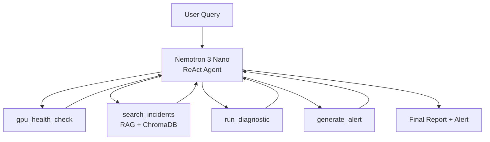

# NemOps — Agentic GPU Infrastructure Monitor

**AI-powered GPU operations agent using NVIDIA Nemotron 3 Nano with Ollama.** Diagnoses GPU failures, searches historical incidents via RAG, and generates structured remediation plans with escalation policies. Designed to run 100% locally on a Mac with 16GB RAM — zero cloud cost.

[](https://huggingface.co/nvidia/nemotron-3-nano)
[](https://ollama.com)
[](https://modelcontextprotocol.io)
[](LICENSE)

> Part of the [Nemotron-Ops-Commander](https://github.com/harshpbajaj/nemotron-ops-commander) project — an AI-powered incident response platform built entirely on NVIDIA Nemotron.

---

## Why NemOps

Built from real infrastructure experience: monitoring **10M+ GPU events/day** and maintaining **99.99% uptime across 10,000+ GPUs**. The 15 incident patterns in the RAG database come from real production failures, including the HBM3 degradation signature that **predicted GPU failures 13 days in advance**.

NemOps puts that operational knowledge into an AI agent that any engineer can query naturally:

```bash
nemops "GPU 3 is showing rising ECC errors. What should I do?"
```

---

## What It Does

The agent exposes four tools through a custom ReAct reasoning loop:

| Tool | Description |
|------|-------------|
| `gpu_health_check` | Checks GPU health metrics — 7 weighted mock scenarios for demo, real NVML data in production via pynvml |
| `search_incidents` | RAG search over 15 GPU failure patterns using ChromaDB + sentence-transformers |
| `run_diagnostic` | Runs 5 diagnostic tests: memory stress, compute stress, NVLink check, PCIe bandwidth, thermal profile |
| `generate_alert` | Creates structured alerts with severity, SLA deadlines, escalation policies, and remediation steps |

### How the Agent Thinks

The ReAct loop gives the agent visible reasoning traces:

```
Thought: The user reports rising ECC errors on GPU 3. I should first check the
         current GPU health, then search for similar ECC incidents in the knowledge base.

Action: gpu_health_check
Action Input: {"gpu_id": 3}

Observation: GPU 3 — Temperature: 72°C, ECC errors: 847 (correctable),
             Memory: 34.2/80.0 GB, Utilization: 89%

Thought: ECC errors are elevated. Let me search for historical ECC incidents.

Action: search_incidents
Action Input: {"query": "rising ECC errors correctable"}

Observation: [INC-001] H100 HBM3 ECC Degradation — Predictive Failure in 13 Days
             Severity: critical | XID: 63, 64 | Resolution: Schedule proactive replacement...
```

---

## Architecture



### How It Uses Nemotron 3 Nano

- **Native tool calling** (qwen3_coder format) for reliable function execution
- **Reasoning traces** for visible diagnostic chain of thought
- **Hybrid Mamba-Transformer MoE** architecture = fast enough for real-time monitoring
- **30B total parameters, 3.5B active** = runs on consumer hardware (16GB Mac via Ollama)

---

## Quick Start

### Prerequisites

- Python 3.11+
- [Ollama](https://ollama.com) installed
- 16GB RAM (Nemotron 3 Nano runs in ~8GB)

### 1. Pull the Model

```bash
ollama pull nemotron-nano
```

### 2. Install

```bash
cd nemops_local_ollama
python -m venv .venv
source .venv/bin/activate
pip install -e .
```

### 3. Seed the Incident Database

```bash
nemops-seed
```

### 4. Run the Agent

```bash
# Default demo query
nemops

# Custom query
nemops "GPU 0 is showing rising ECC errors. Investigate and generate an alert."

# Specific investigation
nemops "Run memory stress test on GPU 0 and check for HBM degradation"
```

---

## MCP Server

Expose all four tools via the **Model Context Protocol** so any AI assistant (Claude Desktop, Cursor, etc.) can monitor your GPUs:

```bash
nemops-mcp    # Start MCP server (stdio transport)
```

Connect from your AI assistant's MCP configuration to access:
- `gpu_health_check` — Real-time GPU metrics
- `search_incidents` — Historical incident search
- `run_diagnostic` — GPU diagnostic tests
- `generate_alert` — Structured alert generation

---

## Streamlit Dashboard

```bash
streamlit run ui/dashboard.py
```

Interactive dashboard with:
- **System status** — Ollama health, model info, agent readiness
- **Quick actions** — One-click health check, ECC simulation, thermal investigation
- **Agent query** — Free-form questions powered by Nemotron
- **Live GPU status** — Real-time GPU metrics panel

---

## GPU Incident Patterns (RAG Database)

15 real GPU failure patterns indexed for semantic retrieval:

| ID | Incident | Severity | XID Codes |
|----|----------|----------|-----------|
| INC-001 | H100 HBM3 ECC Degradation — Predictive Failure in 13 Days | critical | 63, 64 |
| INC-002 | A100 Thermal Throttling — CRAC Unit Failure | warning | — |
| INC-003 | NVLink Errors During Distributed Training | warning | 74 |
| INC-004 | OOM Kills from PyTorch Memory Fragmentation | warning | 31 |
| INC-005 | GPU Fallen Off Bus — XID 79 (PCIe Power Issue) | critical | 79 |
| INC-006 | CUDA Driver Mismatch After System Update | warning | — |
| INC-007 | Memory Leak in PyTorch DataLoader Workers | warning | — |
| INC-008 | Power Brownout Causing GPU Resets | critical | 79, 62 |
| INC-009 | GPU Clock Stuck at Base Frequency | warning | — |
| INC-010 | InfiniBand Timeout in Multi-Node Training | warning | — |
| INC-011 | CUDA Illegal Memory Access in Custom Kernels | critical | 13 |
| INC-012 | Fan Failure Causing Thermal Shutdown | critical | 62 |
| INC-013 | HBM Degradation Pattern — Predictive Failure (13-Day Window) | critical | 63 |
| INC-014 | NVSwitch Error in DGX System | critical | 74 |
| INC-015 | Row Remapping Exhaustion — GPU Replacement Required | critical | 94, 95 |

---

## Tech Stack

| Component | Technology |
|-----------|-----------|
| **LLM** | NVIDIA Nemotron 3 Nano (30B MoE, 3.5B active parameters) |
| **LLM Runtime** | Ollama (local, no cloud, OpenAI-compatible API) |
| **Agent Framework** | Custom ReAct loop (no LangChain/LangGraph dependency) |
| **RAG** | ChromaDB + sentence-transformers (all-MiniLM-L6-v2) |
| **LLM Client** | httpx (direct Ollama API) |
| **Console** | rich (panels, markdown, colored output) |
| **Dashboard** | Streamlit |
| **Tool Protocol** | MCP (Model Context Protocol) — stdio transport |
| **GPU Metrics** | pynvml (real) / weighted mock scenarios (demo) |

---

## Project Structure

```
nemops_local_ollama/
├── pyproject.toml                    # Dependencies, entry points, build config
├── README.md
├── configs/
│   └── agent_config.yaml             # Agent behavior configuration
├── src/nemops/
│   ├── agent.py                      # ReAct loop + CLI entry point + offline fallback
│   ├── llm.py                        # NemotronClient (httpx → Ollama API)
│   ├── mcp_server.py                 # MCP server (stdio transport)
│   ├── tools/
│   │   ├── gpu_health.py             # GPU health (7 weighted mock scenarios + pynvml)
│   │   ├── incident_rag.py           # RAG search over 15 GPU incidents (ChromaDB)
│   │   ├── diagnostics.py            # 5 diagnostic tests (memory, compute, nvlink, pcie, thermal)
│   │   └── alert_gen.py              # Alert generation with escalation policies + SLAs
│   └── data/
│       ├── incidents.json            # 15 GPU incident patterns
│       └── seed_incidents.py         # ChromaDB seeder
├── ui/
│   └── dashboard.py                  # Streamlit dashboard
└── tests/
    ├── test_agent.py
    ├── test_tools.py
    └── test_mcp.py
```

---

## CLI Entry Points

| Command | Description |
|---------|-------------|
| `nemops` | Run the ReAct agent with default or custom query |
| `nemops-mcp` | Start the MCP server (stdio) |
| `nemops-seed` | Seed the ChromaDB incident database |

---

## Development

```bash
# Install in dev mode with test dependencies
pip install -e ".[dev]"

# Run tests
pytest tests/ -v

# Install GPU support (for real NVML metrics)
pip install -e ".[gpu]"
```

---

## Roadmap

- Real-time GPU telemetry ingestion via NVML polling
- Fleet-wide aggregation and alert correlation across multi-node clusters
- Multi-node diagnostic workflows for distributed training environments
- Integration with PagerDuty/Opsgenie for automated escalation
- Fine-tuning Nemotron on GPU-specific incident data

---

## License

MIT

---

*Part of [Nemotron-Ops-Commander](https://github.com/harshpbajaj/nemotron-ops-commander) — built for the NVIDIA GTC 2026 Golden Ticket Developer Contest | #NVIDIAGTC*

*Author: [Harsh Bajaj](https://github.com/harshpbajaj)*
