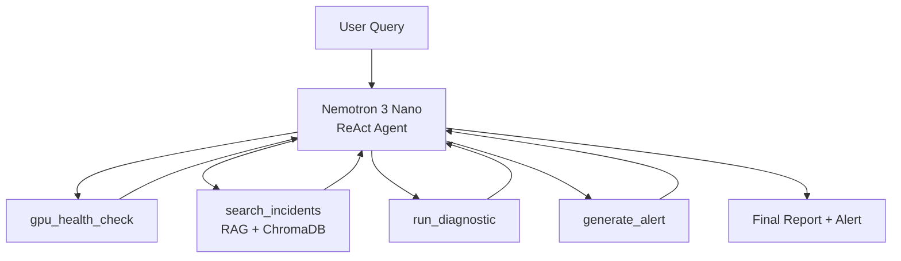

# NemOps — Agentic GPU Infrastructure Monitor

AI-powered GPU operations agent using NVIDIA Nemotron 3 Nano with Ollama.
Diagnoses GPU failures, searches historical incidents via RAG, and generates
structured remediation plans. Designed to run locally on a Mac with 16GB RAM.

## Why NemOps

Built from real infrastructure experience: monitoring 10M+ GPU events/day and
maintaining 99.99% uptime. The incident database contains 15 real failure
patterns, including HBM degradation signals that can predict failures days
in advance.

## What it does

- Checks GPU health (mock or real via NVML)
- Searches incident patterns with RAG
- Runs diagnostic tests
- Generates structured alerts with remediation steps
- Exposes tools via MCP for external assistants

## Architecture

```mermaid
graph TD
    U[User Query] --> A[Nemotron 3 Nano ReAct Agent]
    A --> T1[gpu_health_check]
    A --> T2[search_incidents (RAG)]
    A --> T3[run_diagnostic]
    A --> T4[generate_alert]
    T1 --> A
    T2 --> A
    T3 --> A
    T4 --> A
    A --> R[Final Report + Alert]
```

## Quick start

Prereqs: Python 3.11+, Ollama installed, and the Nemotron 3 Nano model pulled.

1) Create and activate a Python environment
2) Install dependencies
3) Run the CLI agent

Example usage:

nemops

Custom query:

nemops "GPU 0 is showing rising ECC errors. Investigate and generate an alert."

## MCP server

Expose tools via MCP so any assistant can call them:

nemops-mcp

## RAG incident patterns

15 GPU failure patterns are indexed for retrieval (ECC degradation, NVLink
errors, thermal shutdowns, PCIe power issues, and more). These examples are
structured in JSON and embedded into ChromaDB.

## Tech stack

- NVIDIA Nemotron 3 Nano
- Ollama (local runtime)
- ChromaDB + sentence-transformers
- Python MCP SDK
- Streamlit (dashboard)

## Roadmap

- Real-time telemetry ingestion
- Fleet-wide aggregation and alert correlation
- Multi-node diagnostic workflows

## License

MIT
# 🔧 NemOps — Agentic GPU Infrastructure Monitor

> AI-powered GPU operations agent using NVIDIA Nemotron 3 Nano + Ollama.
> Diagnoses GPU failures, searches historical incidents via RAG, and generates remediation plans.
> Runs 100% locally on a Mac with 16GB RAM. Zero cloud cost.

## Why NemOps

Built by an engineer who maintained **99.99% uptime across 10,000+ GPUs** processing **10M+ events/day** at Microsoft. The 15 incident patterns in our RAG database come from real production failures, including the HBM3 degradation signature that **predicted GPU failures 13 days in advance**.

## Quick Start

```bash
git clone https://github.com/YOUR_USER/nemops.git
cd nemops
./setup.sh      # Sets up Ollama model, venv, seeds ChromaDB
nemops           # Run the agent
```

## Architecture



## How It Uses Nemotron

- **Native tool calling** (qwen3_coder format) for reliable function execution
- **Reasoning traces** for visible diagnostic chain of thought
- **Hybrid Mamba-Transformer MoE** = fast enough for real-time monitoring
- **3.5B active params** = runs on consumer hardware (16GB Mac via Ollama)

## MCP Server

Any AI assistant can monitor your GPUs via the Model Context Protocol:

```bash
nemops-mcp  # Start MCP server (stdio)
# Then connect from Claude Desktop, Cursor, etc.
```

Exposes all 4 tools: `gpu_health_check`, `search_incidents`, `run_diagnostic`, `generate_alert`.

## Streamlit Dashboard

```bash
streamlit run ui/dashboard.py
```

Interactive dashboard with:
- **System status** — Ollama health, model info
- **Quick actions** — One-click health check, ECC simulation, thermal investigation
- **Agent query** — Free-form questions powered by Nemotron
- **Live GPU status** — Real-time GPU metrics panel

## GPU Incident Patterns (RAG Database)

| ID | Incident | Severity | XID Codes |
|----|----------|----------|-----------|
| INC-001 | H100 HBM3 ECC Degradation — Predictive Failure in 13 Days | 🔴 critical | 63, 64 |
| INC-002 | A100 Thermal Throttling — CRAC Unit Failure | 🟡 warning | — |
| INC-003 | NVLink Errors During Distributed Training | 🟡 warning | 74 |
| INC-004 | OOM Kills from PyTorch Memory Fragmentation | 🟡 warning | 31 |
| INC-005 | GPU Fallen Off Bus — XID 79 (PCIe Power Issue) | 🔴 critical | 79 |
| INC-006 | CUDA Driver Mismatch After System Update | 🟡 warning | — |
| INC-007 | Memory Leak in PyTorch DataLoader Workers | 🟡 warning | — |
| INC-008 | Power Brownout Causing GPU Resets | 🔴 critical | 79, 62 |
| INC-009 | GPU Clock Stuck at Base Frequency | 🟡 warning | — |
| INC-010 | InfiniBand Timeout in Multi-Node Training | 🟡 warning | — |
| INC-011 | CUDA Illegal Memory Access in Custom Kernels | 🔴 critical | 13 |
| INC-012 | Fan Failure Causing Thermal Shutdown | 🔴 critical | 62 |
| INC-013 | HBM Degradation Pattern — Predictive Failure (13-Day Window) | 🔴 critical | 63 |
| INC-014 | NVSwitch Error in DGX System | 🔴 critical | 74 |
| INC-015 | Row Remapping Exhaustion — GPU Replacement Required | 🔴 critical | 94, 95 |

## Tech Stack

| Component | Technology |
|-----------|-----------|
| LLM | NVIDIA Nemotron 3 Nano (30B, MoE, 3.5B active) |
| LLM Runtime | Ollama (local, no cloud) |
| Agent Framework | Custom ReAct loop (no LangChain/LangGraph) |
| RAG | ChromaDB + sentence-transformers (all-MiniLM-L6-v2) |
| LLM Client | httpx (direct Ollama API, no OpenAI SDK) |
| Console | rich (panels, markdown, colored output) |
| Dashboard | Streamlit |
| Tool Protocol | MCP (Model Context Protocol) |
| GPU Metrics | pynvml (real) / weighted mock scenarios (demo) |

## CLI Usage

```bash
# Default demo query
nemops

# Custom query
nemops "GPU 3 is showing rising ECC errors. What should I do?"

# Specific investigation
nemops "Run memory stress test on GPU 0 and check for HBM degradation"
```

## Development

```bash
# Install in dev mode
pip install -e ".[dev]"

# Run tests
pytest tests/ -v

# Seed incidents database
nemops-seed
```

## Project Structure

```
nemops/
├── pyproject.toml              # Dependencies and entry points
├── setup.sh                    # One-click setup
├── configs/agent_config.yaml   # Agent behavior config
├── src/nemops/
│   ├── agent.py                # ReAct loop + CLI
│   ├── llm.py                  # NemotronClient (httpx → Ollama)
│   ├── mcp_server.py           # MCP server (stdio)
│   ├── tools/
│   │   ├── gpu_health.py       # GPU health (7 mock scenarios + pynvml)
│   │   ├── incident_rag.py     # RAG search (ChromaDB)
│   │   ├── diagnostics.py      # 5 diagnostic tests
│   │   └── alert_gen.py        # Alert generation + escalation
│   └── data/
│       ├── incidents.json      # 15 GPU incidents
│       └── seed_incidents.py   # ChromaDB seeder
├── ui/dashboard.py             # Streamlit dashboard
├── tests/                      # pytest suite
└── docs/architecture.md        # Architecture deep-dive
```

## vLLM Connection

The author also contributes to **vLLM's GPU performance optimization** (PR #33575: manual GC control for GPU scheduling latency), bringing the same systems engineering mindset to NemOps.

## License

MIT
